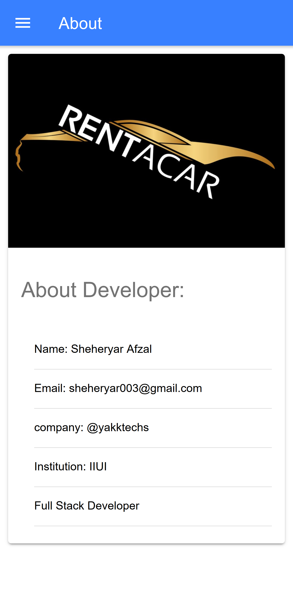
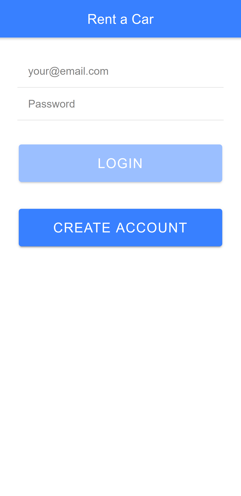
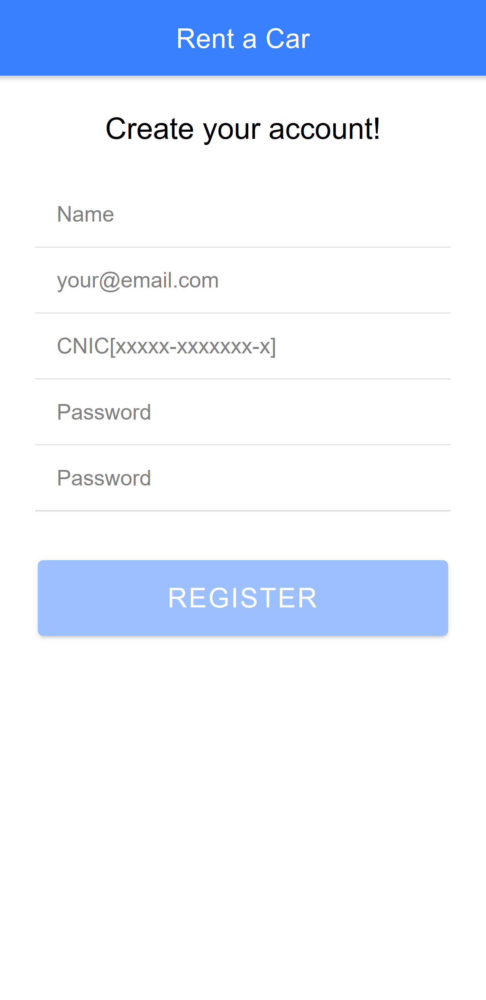
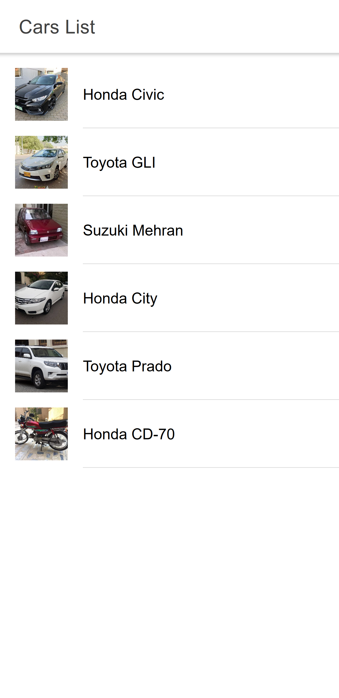
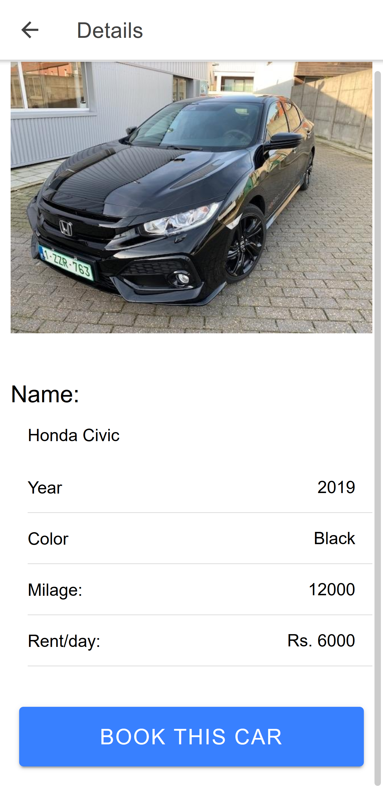
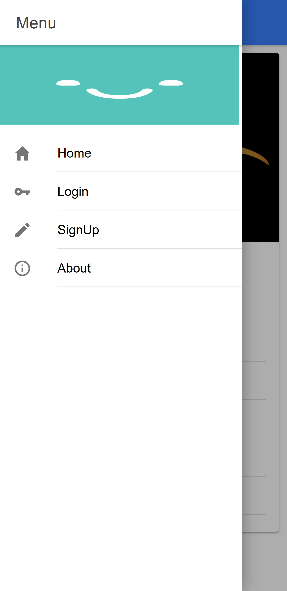

# rent-a-car-app
A simple rental app for renting business
<h1>About Application</h1>

This is simple rental car application which shows you the list of cars to be rented 
and shows their details of the desired car you want to pick for rent

<h1>About FrontEnd</h1>
-> Angular  
-> Html  
-> Css  
-> Ionic Framework  
<h1>BackEnd</h1>
-> Nodejs  
<h1>Database</h1>
-> MongoDB  
 
 
<h1>FrontEnd Screenshots</h1>

<h1>Running Project</h1>
-> git clone or download repository 
-> npm install 
<h2>Thanks!</h2>
